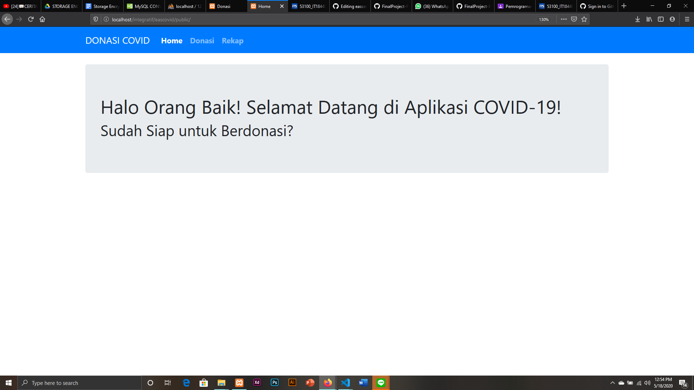
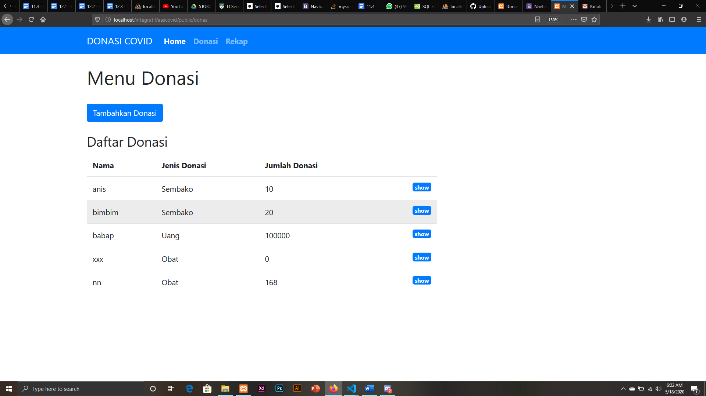
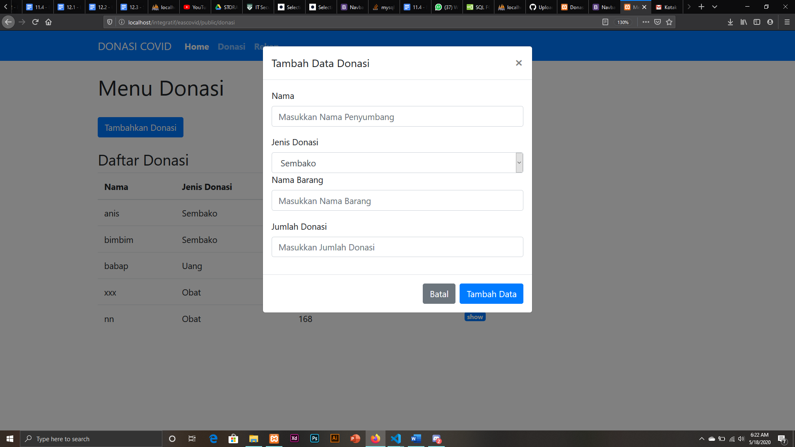
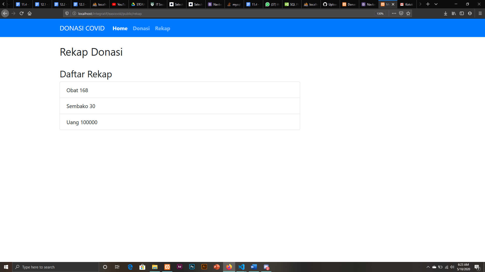
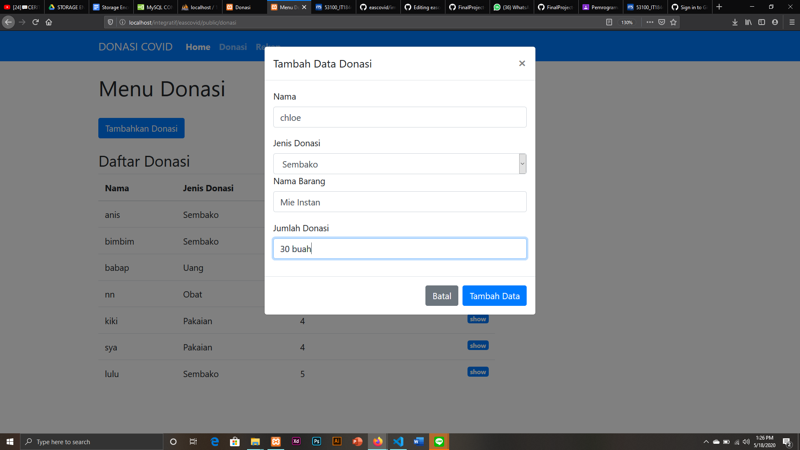
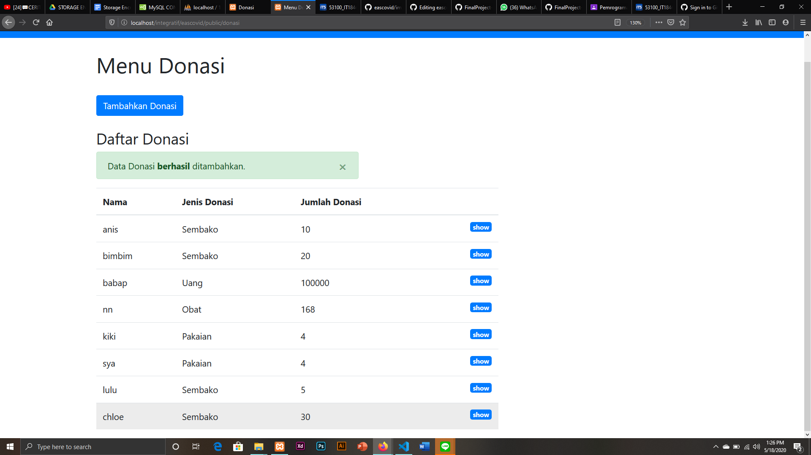
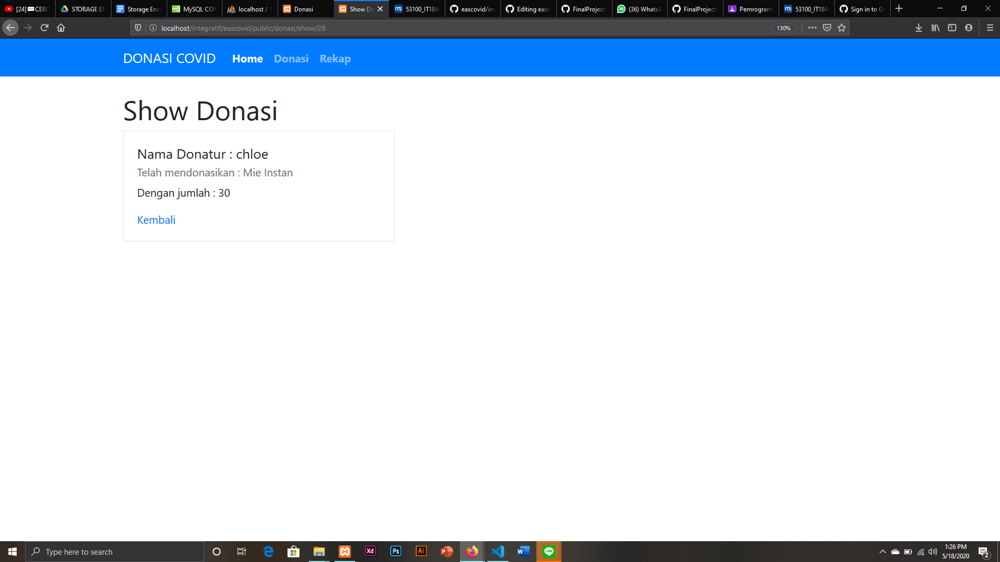

### Anis Saidatur Rochma
### 05311840000002

#### Dokumentasi Final Project Pemrograman Integratif - MVC 

### Home
Berikut adalah Tampilan Home 

### Menu Donasi
Donatur dapat menyumbangkan/mendonasikan sesuatu pada Menu Donasi.  

Dan pada tampilan form donasi, donatur dapat memberi bantuan dengan cara menginputkan barang yang akan didonasikan beserta jumlahnya.

### Rekap
Menu Rekap berfungsi untuk menampilkan semua barang dan jumlah barang yang telah didonasikan yang dibagi berdasarkan jenis donasinya.

## Mari Dicoba!

Alur : User diminta untuk menginputkan nama, jenis donasi , nama barang, dan jumlah bantuan. Apabila ingin melanjutkan, klik tombol **Tambah Data** , namun jika ingin membatalkan , klik tombol **Batal** . Jika proses berhasil, maka akan muncul flash messages berupa tulisan ***Data Donasi berhasil Ditambahkan***

ketika kita mengklik tombol show, maka hasilnya seperti berikut

terdapat detail nama donatur,barang dan total donasi yang disumbangkan  

# Kelemahan
- pada sistem ini, apabila user ingin berdonasi dengan lebih dari 1 barang maka harus memasukkan ulang pada form donasi.
- Menu rekap yang belum terfilter sesuai dengan jenis donasi, maka dari itu yang ditampilkan adalah keseluruhan hasil dari form yang telah diisi. Misal A telah menyumbang Mie 30 pcs. B menyumbang Mie 5 pcs, maka pada menu rekap dihitung secara keseluruhan dari user A dan B , maka akan ditampilkan Jenis Donasi berupa Bahan Makanan sebanyak 35 . 
- 
